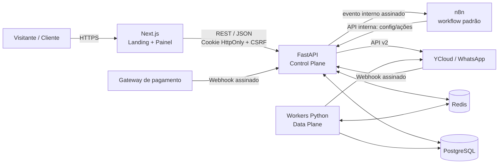

# Documento de Arquitetura e Roadmap — SaaS de Automação WhatsApp

**Status:** proposta para MVP  
**Data:** 20/08/2026  
**Escopo:** Landing Page, Painel do Cliente, provisionamento, integração FastAPI ↔ n8n ↔ YCloud e evolução operacional.

## 1. Decisões executivas

1. **FastAPI é o sistema central e a única fonte de verdade.** Autenticação, tenants, assinatura, configurações, conexões do WhatsApp, autorização, auditoria e métricas pertencem ao backend.
2. **O workflow padrão do n8n é único, versionado e sem estado por cliente.** Não serão criadas cópias nem credenciais n8n por tenant. Cada execução recebe `tenant_id`, `event_id` e os identificadores mínimos, e consulta a API interna para obter um snapshot da configuração.
3. **Webhooks públicos terminam primeiro no FastAPI.** YCloud e o gateway de pagamentos não chamam o workflow diretamente. O backend valida assinatura, deduplica, persiste e publica trabalho no Redis; somente depois dispara o processamento.
4. **Frontend recomendado: Next.js + TypeScript.** Uma única aplicação atende landing (SSR/SSG, SEO) e painel autenticado, usando Tailwind CSS e componentes acessíveis. É mais simples operacionalmente que manter Astro para marketing e uma SPA separada. Se o painel crescer muito, os dois podem ser separados sem alterar a API.
5. **Cobrança fica atrás de uma interface `BillingProvider`.** Stripe Checkout/Billing é a implementação inicial recomendada; para PIX/boleto e operação brasileira, Asaas, Iugu ou Mercado Pago podem ser implementados depois sem mudar o domínio.
6. **Credenciais nunca entram no prompt, no browser ou nos dados de execução do n8n.** Segredos ficam cifrados no backend/secret store. O n8n usa uma credencial técnica curta para chamar a API interna.
7. **Integrações exclusivas são isoladas por definição de integração**, com credenciais, fila, limites e workflow próprios, mas ligadas ao mesmo `tenant_id`.

## 2. Arquitetura de alto nível



### Limite de responsabilidades

| Componente | Responsabilidade | Não deve fazer |
|---|---|---|
| Next.js | UI, validação de formulário, SEO, sessão e experiência de onboarding | Conter segredo YCloud, decidir entitlement ou chamar n8n |
| FastAPI | Domínio, RBAC, multi-tenancy, billing, configuração, webhooks, auditoria e orquestração | Executar automações longas dentro da requisição HTTP |
| PostgreSQL | Fonte de verdade transacional e histórico | Servir como fila improvisada |
| Redis | Fila, locks, rate limit, cache de curta duração e idempotência auxiliar | Ser fonte definitiva de tenant, cobrança ou configuração |
| n8n | Orquestração visual do fluxo comum e conectores genéricos | Ser cadastro de clientes, guardar preferências ou receber webhooks sem validação |
| Worker Python | Envio/consumo assíncrono, retries, concorrência e tarefas de duração maior | Inferir tenant por dados não validados |
| YCloud | Transporte oficial do WhatsApp e eventos do canal | Ser fonte primária do estado comercial do SaaS |

## 3. Painel do cliente

### 3.1 Frontend

**Stack recomendada:** Next.js, TypeScript estrito, Tailwind CSS, shadcn/ui ou Radix, React Hook Form + Zod e TanStack Query apenas onde cache cliente for útil.

Rotas iniciais:

- `/` — landing page, benefícios, prova social, FAQ e CTA;
- `/precos` — plano, limites, custos extras de WhatsApp e integrações sob medida;
- `/login`, `/cadastro`, `/recuperar-senha`;
- `/app/onboarding` — checklist de pagamento, empresa, WhatsApp, teste e ativação;
- `/app/inicio` — saúde da conexão, consumo e alertas;
- `/app/atendimento` — nome, tom, instruções/prompt e fallback humano;
- `/app/horarios` — timezone, janelas por dia, feriados e mensagem fora do horário;
- `/app/whatsapp` — conexão, número, WABA, qualidade e reconexão;
- `/app/cobranca` — assinatura, faturas e portal do gateway;
- `/app/equipe` — membros e papéis, pós-MVP;
- `/app/integracoes` — catálogo padrão e integrações customizadas contratadas.

Landing e painel podem viver no mesmo repositório, mas com layouts e bundles separados. Conteúdo público deve ser renderizado no servidor/estático; páginas do painel não devem ser indexadas.

### 3.2 Comunicação frontend → FastAPI

- API versionada em `https://api.dominio.com/v1` e frontend em `https://app.dominio.com` (ou ambos sob o mesmo domínio).
- Sessão em cookie `HttpOnly`, `Secure`, `SameSite=Lax`; refresh token rotacionado e armazenado apenas como hash. Para requisições mutáveis, proteção CSRF por token de dupla submissão ou header emitido pelo backend.
- CORS restrito aos domínios oficiais. Nunca usar `*` com credenciais.
- Toda consulta autenticada resolve `user_id` e `tenant_id` no servidor. O backend não confia em um `tenant_id` livre enviado pelo browser.
- PATCH com controle otimista: o cliente envia `version`; conflito retorna `409` e evita sobrescrever edição concorrente.
- Configurações são validadas por Pydantic e persistidas numa transação com uma nova versão/auditoria.

Contrato ilustrativo:

```http
PATCH /v1/tenant/settings
If-Match: "7"
Content-Type: application/json

{
  "company_name": "Clínica Exemplo",
  "timezone": "America/Sao_Paulo",
  "business_hours": {...},
  "assistant": {
    "tone": "acolhedor",
    "instructions": "...",
    "human_handoff_message": "Vou chamar uma pessoa da equipe."
  }
}
```

Resposta: configuração sanitizada, `version: 8`, `updated_at` e status de publicação. Prompt deve ter limite de tamanho, validação de conteúdo e histórico; nunca aceitar que ele altere políticas de segurança ou ferramentas autorizadas.

### 3.3 Como as variáveis chegam ao workflow base

Não há alteração do JSON do workflow. O caminho recomendado é:

1. YCloud envia evento para `POST /v1/webhooks/ycloud`.
2. FastAPI valida `YCloud-Signature` usando o corpo bruto, deduplica por `event.id` e identifica a conexão pelo `wabaId`/número de destino.
3. Em uma transação, grava o evento e um item de outbox com `tenant_id`, `event_id` e `config_version` ativa.
4. Um dispatcher publica a tarefa no Redis. A resposta ao webhook é rápida; processamento não bloqueia a entrega.
5. Worker/backend chama o webhook interno do workflow padrão, autenticado por HMAC ou token de serviço, com apenas IDs e `correlation_id`.
6. O primeiro nó do n8n chama `GET /internal/v1/executions/{event_id}/context`. A API retorna um snapshot sanitizado e de curta validade: preferências, plano/entitlements, horário calculado, contato, mensagem e ferramentas permitidas.
7. O workflow executa a lógica e solicita ações ao backend (`POST /internal/v1/messages`, `POST /internal/v1/handoffs`); ele não usa uma API key YCloud pertencente ao cliente.
8. Resultado e erro são enviados para a API, correlacionados por `event_id`/`execution_id`.

O snapshot torna reprocessamentos determinísticos: uma mensagem em andamento não muda de comportamento porque o cliente editou o prompt segundos depois.

### 3.4 API mínima

| Área | Endpoints principais |
|---|---|
| Auth | `POST /auth/register`, `/auth/login`, `/auth/refresh`, `/auth/logout`, `/auth/password/*` |
| Tenant | `GET /tenant`, `PATCH /tenant`, `GET/PATCH /tenant/settings` |
| WhatsApp | `POST /whatsapp/onboarding/session`, `POST /whatsapp/onboarding/complete`, `GET /whatsapp/connection`, `POST /whatsapp/test`, `DELETE /whatsapp/connection` |
| Billing | `POST /billing/checkout`, `POST /billing/portal`, `GET /billing/subscription` |
| Webhooks | `POST /webhooks/billing/{provider}`, `POST /webhooks/ycloud` |
| Operação | `GET /usage`, `GET /health`, `GET /onboarding/status` |
| Interna | `GET /internal/v1/executions/{id}/context`, `POST /internal/v1/messages`, `POST /internal/v1/executions/{id}/result` |

O OpenAPI gerado pelo FastAPI deve produzir automaticamente o client TypeScript, evitando contratos duplicados à mão.

## 4. Multi-tenancy e dados

### 4.1 Estratégia

Para o MVP: **banco e schema compartilhados, todas as tabelas de domínio com `tenant_id`**, índices compostos e uma camada obrigatória de escopo no repositório/serviço. Acrescentar PostgreSQL Row-Level Security como defesa em profundidade assim que o caminho de conexão puder definir o tenant por transação. Usuários superadmin usam conexão/papel separado e auditado.

Não usar um banco por cliente agora: aumenta migrações, backups e custo sem benefício proporcional. Integrações enterprise podem ganhar isolamento adicional mais tarde.

### 4.2 Entidades essenciais

```text
users
tenants
memberships (user_id, tenant_id, role)
plans / plan_entitlements
subscriptions (provider, customer_id, subscription_id, status, period_end)
tenant_settings (tenant_id, version, payload_jsonb, is_active)
whatsapp_connections (tenant_id, provider, waba_id, phone_number_id, display_number, status)
provider_secrets (tenant_id, provider, encrypted_payload, key_version)
webhook_events (provider, external_event_id UNIQUE, tenant_id, status, raw_payload, attempts)
outbox_events (aggregate_id, type, payload, published_at)
message_events (tenant_id, provider_message_id, direction, status, timestamps)
workflow_executions (tenant_id, event_id, config_version, n8n_execution_id, status)
usage_counters (tenant_id, metric, period, quantity)
custom_integrations (tenant_id, type, workflow_ref, status, encrypted_credentials_ref)
audit_log (tenant_id, actor_id, action, target, before_json, after_json, ip, created_at)
```

Regras: UUID/UUIDv7; timestamps UTC; telefones E.164; `UNIQUE(provider, external_event_id)`; restrições únicas para WABA/número; soft delete somente onde necessário; dados sensíveis com política explícita de retenção.

## 5. Fluxo de provisionamento após assinatura

### Pré-cadastro e checkout

1. Visitante escolhe o plano na landing.
2. Frontend cria uma conta e organização em estado `pending_payment`, ou solicita checkout informando o e-mail. A opção mais segura para conciliação é criar primeiro `user + tenant` numa transação.
3. `POST /billing/checkout` cria o customer e uma sessão recorrente no gateway, incluindo `tenant_id` em metadata. O servidor escolhe o `price_id`; nunca aceita preço arbitrário do browser.
4. Browser é redirecionado ao Checkout hospedado. A URL de sucesso serve apenas para UX e mostra “confirmando pagamento”; **não provisiona acesso**.

### Confirmação e criação do tenant ativo

5. Gateway chama o webhook assinado. FastAPI valida assinatura sobre o corpo bruto e registra o `event_id` com unicidade.
6. Para `checkout.session.completed`/equivalente, salva IDs externos. O acesso só fica `active` quando o evento e o estado consultado ao provedor confirmarem assinatura paga/ativa (normalmente `invoice.paid` ou equivalente).
7. Na mesma transação: atualiza `subscriptions`, muda tenant para `provisioning`, cria configurações default versionadas, entitlements, limites de uso e evento de outbox `tenant.provisioning.requested`.
8. Worker idempotente consome o evento, cria recursos internos e marca cada etapa numa state machine. Repetir o webhook ou a tarefa não duplica registros.
9. Tenant passa a `awaiting_whatsapp`; o usuário recebe link para continuar o onboarding.

### Conexão automatizada com a YCloud

10. No painel, “Conectar WhatsApp” inicia o **Embedded Signup** da Meta/YCloud. O browser recebe somente parâmetros públicos e um `state` curto, assinado, de uso único e ligado ao tenant/usuário.
11. Ao concluir, o frontend envia o resultado/código ao backend. O backend troca/valida os dados com a YCloud, associa `waba_id` e `phone_number_id` ao tenant e registra o número quando exigido pelo fluxo de parceiro.
12. O sistema usa **um webhook global YCloud** para a plataforma, não um por tenant. A própria documentação limita endpoints por conta; o roteamento ocorre no FastAPI por WABA/número. O segredo do webhook é salvo no cofre de segredos.
13. Backend consulta o número/WABA, confirma status, grava `whatsapp_connections=connected` e dispara uma mensagem/teste controlado.
14. Cliente conclui nome, timezone, horários, instruções e fallback. `POST /onboarding/activate` verifica a checklist inteira e publica a versão 1 da configuração.
15. Tenant muda para `active`; o motor passa a aceitar eventos. Até lá, eventos recebidos ficam registrados, mas não geram resposta automática.

### Renovação, inadimplência e cancelamento

- `invoice.paid`: renova `access_until`, zera/abre período de quota e mantém ativo.
- `payment_failed`/`past_due`: entra em `grace_period`, notifica e restringe novas campanhas; atendimento pode continuar por uma janela configurável.
- `canceled`/`unpaid`: muda para `suspended`, bloqueia novos envios e automações, preservando dados conforme retenção contratual.
- Reativação é idempotente e não reconecta/recria WABA desnecessariamente.

State machine sugerida:

```text
pending_payment → provisioning → awaiting_whatsapp → configuring → active
                                                   ↘ failed (retry/admin)
active → grace_period → suspended → canceled
   ↑          │             │
   └──────────┴─────────────┘ (pagamento regularizado)
```

## 6. Workflow padrão e integrações exclusivas

### Workflow padrão

- Um workflow publicado por ambiente (`development`, `staging`, `production`) e identificado no backend por `workflow_release`.
- Entrada com schema fixo e versão (`schema_version`).
- Nós nunca executam SQL interpolado pelo usuário; usam endpoints internos com autorização de serviço.
- Toda saída carrega `tenant_id`, `event_id`, `correlation_id` e `config_version`.
- Timeout, retry e dead-letter queue definidos; operações de envio usam `idempotency_key`.
- Deploy canário por tenant: `workflow_release` permite migrar 5% dos clientes antes do rollout total.

### Upsells customizados

Cada integração exclusiva possui `custom_integration`, credenciais cifradas próprias, entitlement contratual, fila/rate limit e `workflow_ref`. Ela é acionada por evento de domínio, não por alteração do workflow padrão. Falha no ERP de um cliente não pode consumir workers ou pausar mensagens dos demais.

## 7. Segurança, privacidade e operação

- TLS em todos os domínios; PostgreSQL/Redis sem exposição pública no Easypanel.
- Redes internas separadas; somente proxy público alcança FastAPI/Next.js/n8n webhook necessário.
- n8n editor não público ou protegido por VPN/SSO/IP allowlist; endpoints internos com HMAC, timestamp e prevenção de replay.
- Senhas com Argon2id; MFA para administradores; RBAC `owner/admin/member/support`.
- Segredos com envelope encryption (chave mestra fora do banco) e rotação. Logs sempre mascaram tokens, prompts sensíveis e telefones quando possível.
- Validação de assinatura de YCloud e billing antes de parsear/processar; guardar corpo bruto para auditoria com retenção curta.
- Idempotência obrigatória em webhooks, provisioning e envio. Retry exponencial com jitter e DLQ.
- Rate limit por IP, usuário, tenant e número. Circuit breaker em APIs externas.
- Backups PostgreSQL automáticos, criptografados e com teste periódico de restauração; política RPO/RTO definida antes do go-live.
- LGPD: base legal, DPA/termos, minimização, exportação/exclusão, retenção e registro de operadores/suboperadores.
- Observabilidade: logs JSON com correlation ID, métricas Prometheus/OpenTelemetry, tracing entre API-worker-n8n e alertas para fila, erro, latência, webhook e pagamento.

## 8. Topologia no Easypanel

Serviços separados, mesmo que inicialmente na mesma VPS:

```text
reverse-proxy / TLS
web-nextjs
api-fastapi (2 réplicas quando necessário)
worker-messages
worker-provisioning
n8n-main
n8n-worker (quando ativar queue mode)
postgres
redis (AOF + senha + rede privada)
observability
```

FastAPI e workers usam seu próprio banco/schema de aplicação. n8n deve usar banco PostgreSQL e credenciais separados; não compartilhar tabelas internas. Redis pode estar na mesma instância no MVP, mas com ACLs/prefixos ou databases lógicos e política de memória compatível. Em escala, separar a fila crítica do Redis de cache/n8n.

## 9. Roadmap de desenvolvimento

Estimativa é por sequência e critério de aceite, não calendário; a velocidade depende do estado real do motor já em finalização.

### Fase 0 — Contratos e fundação

**Código:** monorepo (`apps/api`, `apps/web`, `workers`, `infra`, `docs`), configuração por ambiente, lint/typecheck/test, Docker Compose local, migrações Alembic, CI e convenções de erro/log/correlation ID.

**Decisões:** gateway inicial; modalidade YCloud (conta única de parceiro versus credenciais por cliente); limites do plano; regra de carência; retenção e domínio.

**Aceite:** frontend, API, PostgreSQL e Redis sobem localmente; CI executa testes; migração sobe e desce em banco descartável.

### Fase 1 — Núcleo multi-tenant e autenticação

**Código:** modelos `users/tenants/memberships`, login/cadastro/refresh/logout, recuperação de senha, RBAC, middleware de tenant, audit log e testes negativos de isolamento.

**Aceite:** dois tenants nunca acessam dados um do outro; sessões podem ser revogadas; endpoints OpenAPI geram client TypeScript.

### Fase 2 — Configurações e primeira casca do painel

**Código:** `tenant_settings` versionada, schemas Pydantic, endpoints GET/PATCH, telas de empresa/horários/assistente, navegação, estados vazios/erro/loading e onboarding checklist.

**Aceite:** cliente edita e recupera preferências; conflito de versão retorna 409; auditoria registra antes/depois; testes cobrem timezone e horários cruzando meia-noite.

### Fase 3 — Billing e entitlement

**Código:** interface `BillingProvider`, Stripe Checkout/Billing inicial, webhook assinado/deduplicado, customer portal, state machine da assinatura, grace period e telas de cobrança.

**Aceite:** pagamento de teste ativa exatamente uma vez; retry duplicado não duplica tenant/assinatura; falha/cancelamento suspende conforme regra; retorno do Checkout sozinho não ativa acesso.

### Fase 4 — Onboarding YCloud

**Código:** Embedded Signup, callback seguro, vínculo WABA/número, webhook global, verificação de assinatura, reconciliação periódica, tela de status e envio de teste.

**Aceite:** novo cliente conecta sem intervenção manual; eventos são roteados ao tenant correto; número duplicado é rejeitado; segredo nunca aparece no browser/log.

### Fase 5 — Ponte com o motor e workflow n8n

**Código:** ingestão → inbox/outbox → Redis, endpoint de contexto, autenticação de serviço, workflow base com schema versionado, callbacks de resultado, idempotência, retries e DLQ. Adaptar o motor existente em vez de criar outra fila paralela.

**Aceite:** mensagem real percorre YCloud → API → Redis/worker → n8n → API → YCloud; replay do mesmo evento não envia duas respostas; troca de config não altera execução em curso; teste de carga valida concorrência entre tenants.

### Fase 6 — Landing e funil self-service

**Código/conteúdo:** home, preços, FAQ, termos/privacidade, CTA para cadastro/checkout, analytics consentido, eventos de funil, SEO, performance e e-mails transacionais.

**Aceite:** fluxo anônimo → cadastro → pagamento → onboarding funciona em mobile; Lighthouse e acessibilidade dentro das metas definidas; preços e custos variáveis são claros.

### Fase 7 — Operação e beta fechado

**Código/infra:** dashboards, alertas, backup/restore, runbooks, suporte com impersonation somente auditada (ou visão read-only), reconciliação de billing/YCloud, feature flags, canário e testes E2E.

**Aceite:** restore ensaiado; alerta chega ao canal correto; DLQ pode ser reprocessada com segurança; 3–5 clientes beta completam onboarding sem acesso ao n8n.

### Fase 8 — Go-live e evolução

- hardening, teste de carga/caos básico, revisão LGPD e pentest focado em isolamento;
- métricas de negócio: ativação, tempo até conectar, mensagens/tenant, falhas, churn e margem;
- equipe/RBAC avançado, templates, relatórios, integrações padrão e catálogo de upsells;
- separar serviços/filas apenas quando métricas demonstrarem necessidade.

## 10. Ordem das próximas tarefas que faremos juntos

1. Fechar as quatro decisões da Fase 0 e escrever ADRs curtos.
2. Criar o esqueleto do monorepo e ambiente local reproduzível.
3. Implementar banco, migrações e isolamento multi-tenant.
4. Implementar auth e sessão segura.
5. Gerar client da API e montar layout/onboarding do painel.
6. Entregar edição versionada de configurações.
7. Integrar billing em sandbox e testar todo o ciclo por webhooks.
8. Integrar Embedded Signup/YCloud em sandbox/conta parceira.
9. Conectar o motor existente ao contrato de inbox/outbox e contexto.
10. Implementar o workflow n8n padrão e os testes E2E.
11. Construir landing, textos legais/comerciais e instrumentação do funil.
12. Preparar Easypanel, observabilidade, backups e beta.

### Progresso de implementação — 20/08/2026

- Landing Page Nexus: concluída, responsiva e com demonstrações interativas da IA.
- Fundação FastAPI/PostgreSQL/Redis: criada.
- Cadastro com criação transacional de usuário, tenant, membership e configuração inicial: criado.
- Sessão por cookie HttpOnly e proteção CSRF para alterações autenticadas: criada.
- Configuração versionada de empresa, horários, tom, prompt e fallback humano: criada.
- Painel funcional conectado aos contratos da API: criado.
- Contexto interno protegido por token de serviço para consumo do workflow n8n: criado.
- Cobrança recorrente: adapter Stripe, Checkout, Portal e webhook assinado criados.
- Idempotência dos eventos de cobrança, ciclo de assinatura e outbox de provisionamento: criados.
- UI do painel alinhada à identidade premium da landing e jornada de cobrança: criada.
- Onboarding YCloud: sessão assinada por tenant, vínculo de número/WABA, webhook global com HMAC e idempotência criados.
- UI do WhatsApp: autorização guiada, estados de progresso/conectado e simulação local criados.
- Validação real do Embedded Signup: pendente apenas das credenciais e permissões da conta parceira Meta/YCloud.
- Ponte com o motor: outbox transacional, Redis Streams, consumer groups, recuperação de pendências e DLQ criados.
- Execuções determinísticas: snapshot de `config_version`, contexto interno e callbacks n8n criados.
- Saída centralizada: n8n solicita a mensagem ao FastAPI e o worker Python envia pela YCloud com idempotência.
- Workflow base multi-tenant: gerado sem catálogo Google Sheets e sem regras da antiga clínica.
- Próxima fase ativa: implantação no Easypanel, primeiro teste real e observabilidade do beta.

## 11. Riscos e decisões ainda abertas

| Tema | Risco | Recomendação inicial |
|---|---|---|
| Modalidade YCloud | Embedded Signup e automação dependem do status de parceiro e das APIs liberadas | Confirmar contrato/Partner Center antes da Fase 4; fazer spike técnico cedo |
| Gateway | Stripe é simples tecnicamente, mas mix PIX/boleto/fiscal pode pedir provedor local | Interface de adapter; validar com contador e público-alvo |
| “Prompt livre” | Prompt injection, custo imprevisível e comportamento inseguro | Campos estruturados + bloco livre limitado + ferramentas allowlist |
| Uma VPS | Falha única e contenção entre API, banco, Redis e n8n | Backups externos, limites por container e plano de migração; separar banco primeiro |
| n8n no caminho crítico | Latência, retenção de execuções e indisponibilidade | Fila antes do n8n, timeouts, DLQ e fallback; manter envio crítico no worker Python |
| Isolamento lógico | Bug de query pode vazar dados | Repository scoping, testes adversariais e RLS como defesa adicional |
| Custos WhatsApp/IA | Margem pode desaparecer em uso intenso | Medição por tenant, quotas e limites desde o primeiro release |

## 12. Critérios de sucesso do MVP

- Cliente paga, cria conta, conecta WhatsApp e ativa atendimento sem intervenção manual.
- Um único workflow atende todos os tenants sem armazenar estado ou segredo por cliente.
- Nenhum webhook repetido causa duplicidade de provisionamento ou mensagem.
- Alterações de configuração são versionadas, auditáveis e entram apenas em novas execuções.
- Inadimplência/cancelamento altera acesso automaticamente e de forma reversível.
- Operador consegue diagnosticar uma mensagem ponta a ponta pelo `correlation_id`.
- Backup restaurável, alertas e procedimento de incidentes existem antes da venda pública.

## Referências técnicas oficiais

- YCloud: [Webhook Integration Guide](https://docs.ycloud.com/reference/webhook-integration-guide), [eventos e payloads](https://docs.ycloud.com/reference/webhook-events-payloads), [Embedded Signup](https://helpdocs.ycloud.com/partner-center/english-en-2/ji-shu-kai-fa-huo-ban/embedded-signup).
- n8n: [documentação oficial](https://docs.n8n.io/) e [security audit](https://docs.n8n.io/hosting/securing/security-audit/).
- Stripe: [Checkout para assinaturas](https://docs.stripe.com/payments/checkout/build-subscriptions), [webhooks de assinatura](https://docs.stripe.com/billing/subscriptions/webhooks) e [fulfillment confiável por webhook](https://docs.stripe.com/checkout/fulfillment).
